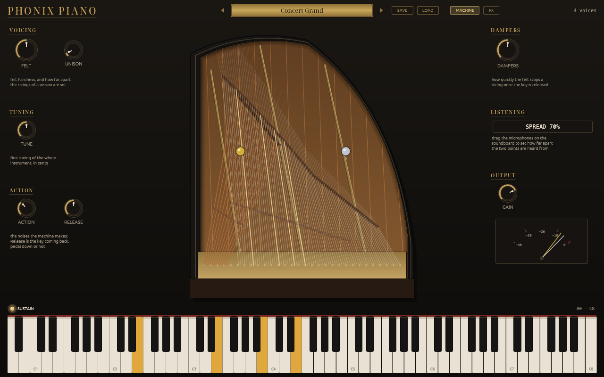
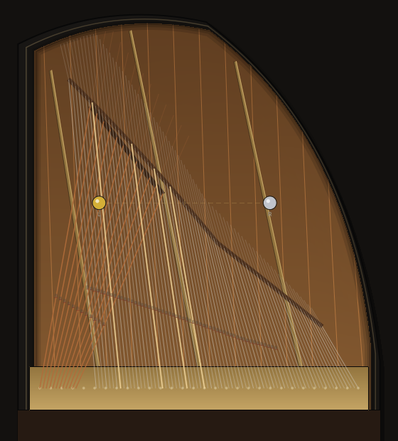
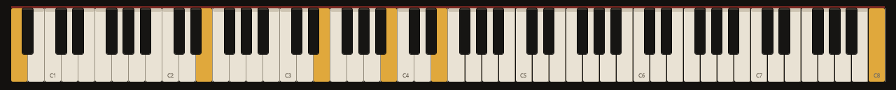
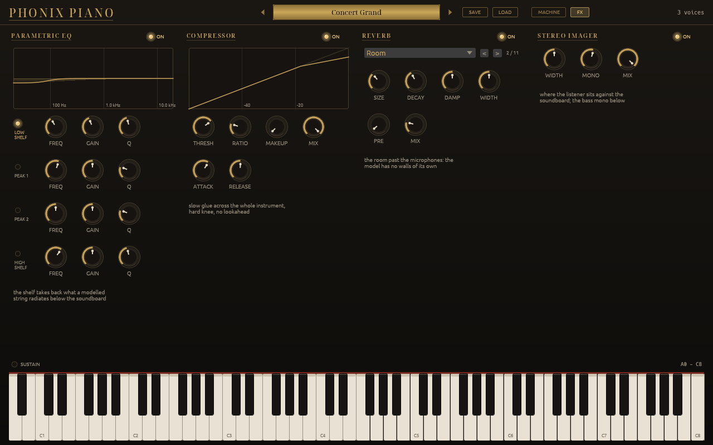

# Phonix Piano

**EXPERIMENTAL.** Under development and not yet judged in use: the sound, the factory
bank and the editor can change from one version to the next. What cannot change is
listed in `COMPAT.md`.

A grand piano built from the physics, not from samples.

The hammer's force is computed against the string rather than assumed. The
strings of a unison are coupled through a real bridge. The soundboard is *in the
loop*, loading the strings, rather than a reverb hung on the output. The decay of
every note, the double decay, the beating of a unison, sympathetic resonance, the
sustain pedal and the stereo image are all consequences of that chain rather than
settings inside it.

Sources: Humbert (IRCAM/ATIAM 2002) for the modal formulation and the real-time
contact scheme; Chabassier (2012) for the string, the felt and the measured
stringing of a Steinway D; Ege (2009, 2013) for the soundboard's measured modes
and damping; Chaigne & Askenfelt (JASA 1994) for the hammer felt.

## Status

Not versioned yet: what is published is a nightly, one rolling prerelease
carrying the Linux and Windows VST3 and CLAP bundles built from the head of
main. The model runs and the tests are green; what is open is below, and the
first line is what one hears.

| open | |
|---|---|
| the treble's upper partials | through the output, the second to fourth partials of C6 to C7 sit 8 to 30 dB above the Iowa Steinway's. No lever on the felt reaches it without costing the top octave's level |
| a single note is nearly mono | a held note's two channels correlate at 0.9. Width comes from the notes' positions on the bridge, not from within a note |
| the modes not carried | the plate stops at 16 kHz and never retires a mode; the strings' truncation is accounted for at the bridge and under the felt |
| a chord's first block | nine treble notes struck in one block cost it 2.2 ms against 1.3: the contact's sub-step solve |

Deliberate, and staying: sympathetic resonance is one shared bank rather than
87 strings, and a live pass is not the same render as an offline bounce.

`LIMITATIONS.md` carries all of it with the measurements and the dates they
were taken, plus what was built and left switched off and which constants were
chosen by ear. `REFERENCES.md` lists the published work this implements, paper
by paper, with the module that follows each one.

## The editor

A grand piano seen from above. The two microphones are dots you drag on the
soundboard, because `width` is where the model listens to the plate; the strings
light as they sound; the dampers lift when the pedal goes down. The technician's
adjustments sit around the case.

The soundboard, with the microphones on it:

Behind a switch, the effects the patch carries: a shelf, the glue, the
room and the width. Which four and in what order is fixed; everything
inside them is the player's.

## Layout

    crates/piano            the engine. serde, and libc on Linux.
    crates/piano-ui         the egui editor
    crates/piano-plugin     VST3 / CLAP, via nice-plug
    crates/piano-research   measurement tools

The editor is a separate crate rather than a feature of the engine, and that is
load-bearing. Cargo unifies features across a resolved graph, so an optional
`egui` inside `piano` would be switched on for the engine's own tests by any
`cargo test --workspace`. A crate boundary is the only thing that makes "the
engine never sees egui" true rather than merely intended:

    cargo tree -p piano --edges normal   # serde; plus libc on Linux

The engine's dependency list is deliberately that short. `libc` is there for one
thing and one thing only; putting the worker threads at the audio callback's
real-time priority, which is a Linux syscall; and nothing in the DSP touches
it; on every other target the engine is serde alone. There is no `[features]`
table in `crates/piano/Cargo.toml`, and the absence is the contract.

## Installing

Take the archive for your platform from the nightly prerelease and unzip it:

    Linux      Piano.vst3/  ->  ~/.vst3/            Piano.clap  ->  ~/.clap/
    Windows    Piano.vst3\  ->  C:\Program Files\Common Files\VST3\
               Piano.clap   ->  C:\Program Files\Common Files\CLAP\

The binaries are built for `x86-64-v3`: they need an x86-64 CPU with AVX2 and
FMA, which is any Intel from Haswell (2013) or AMD from Excavator (2015) on. An
older machine gets an illegal-instruction crash on load rather than a message;
build from source with the `target-cpu` line in `.cargo/config.toml` changed.
The Windows binaries are not code-signed: SmartScreen asks once. macOS is not
built.

## Building

    cargo test                      # 152 tests, plus 136 measurement probes
    scripts/build_plugins.sh        # VST3 + CLAP bundle for this platform
    scripts/build_plugins.sh --windows

The bundle lands in `target/bundled/<platform>/`, laid out as the VST3 spec
wants. Any host that scans a directory will find it there; for a development
tree, point the host's search path at it rather than installing.

The measurement probes are `#[ignore]`d and do not run there; the 152 that do
take the better part of an hour in a debug build, and far less with `--release`.
`LIMITATIONS.md` has the details, including one test that is load-sensitive.

Two things the build assumes about this machine, both in `.cargo/config.toml`
and both easy to change. It compiles for `x86-64-v3`, so it needs an x86-64 CPU
from roughly 2013 onward and will want that line dropped or replaced on another
architecture. And it raises `RUST_MIN_STACK` to 16 MiB, because a debug
`cargo test` gives each test a 2 MiB thread and the engine's un-optimised call
tree sums past it; building from outside this config will hit that as a stack
overflow rather than as a test failure. The bundling script wants `bash` and
`python3`, and the Windows cross-build additionally wants `cargo-xwin` and
`clang-cl`. macOS is not built.

The effects, the audio-thread toolbox and the editor's design system come
from the Phonix SDK, mirrored under `vendor/phonix-sdk` as a squashed git
subtree so a clone of this repository alone builds; nothing under `vendor/`
is edited here, and `git subtree pull --prefix vendor/phonix-sdk <sdk> <tag>
--squash` moves it. `.github/workflows/ci.yml` builds and tests on Linux and
Windows on every push, and moves the rolling `nightly` prerelease to what it
built; none of it needs a secret.

## Measurement tools

    cargo run --release -p piano-research --bin piano_bench
    cargo run --release -p piano-research --bin board_tf

`piano_bench` reports the soundboard's mode count, where the coupling energy
sits, and the realtime factor at several polyphonies. `board_tf` prints the
plate's radiated magnitude response driven at a bridge point.

They need `hound` and `rustfft` as real dependencies, which is why they are a
crate of their own: a `[[bin]]` cannot see dev-dependencies, and putting a WAV
writer in the engine's graph would break the dependency contract above.

`engine_bench` times only the process path, at one, eight, sixteen and
thirty-one voices, on the exact board a bounce renders and on the decoupled
board live playing runs. It is for comparing one build against another; a
change to the release profile is judged on its live rows. Measured here, thin
LTO with sixteen codegen units and one unit with fat LTO are within noise on
the live rows, and fat LTO is ten to twenty percent slower on the exact board.

## Hearing it

There is no audio in this repository, and that is on purpose: a render is made
to be judged and thrown away, not kept in the history, and the scores that were
used to judge it are other people's music. So the way to hear the instrument is
to build the bundle above and play it, or to render your own material from the
tests.

The listening renders the model was developed against are still here as
`#[ignore]`d tests. They write 48 kHz WAVs under `renders/`, which is ignored:

    cargo test -p piano --release --lib -- --ignored --nocapture \
        render_the_chord_attack

`render_the_sympathy_ab` and `render_the_pp_mechanics_ab` are the same shape.
Each renders one passage with one thing changed, which is what they are for:
they answer a question rather than showing the instrument off.

## Effects

Every patch carries a chain of four effects, in a fixed order, that the
plugin runs after the engine and the editor shows on its effects page: a
parametric equaliser with a low shelf, since a modelled string radiates
below what a real soundboard does; a slow bus compressor for glue; a
room, because the model has no boundary reflections and their absence
is what reads as unreal; and a stereo width, the image as the
microphones set it with the bass mono below. The engine itself owns none
of them, so its tests hear the instrument bare. The chain is part of the
patch and travels with a project; a project saved before it existed
carries an empty chain, which is a real no-op. `COMPAT.md` says what of
this is frozen.

Behind the chain, and not a slot of it, the plugin runs the family's
fader: a ride at full scale with a short lookahead that holds whatever
the level control pushes past it. Nothing a plugin of this family hands
its host passes full scale.

## Compatibility

`COMPAT.md` lists what cannot change: the VST3 class id, the parameter ids, the
patch's serde field names and their defaults, and the factory bank's names *and
order*. All of them are written into files other programs read, and all of them
are covered by a test.

## Licence

MIT or Apache-2.0, at your option; `LICENSE-MIT` and `LICENSE-APACHE` are both
here. The editor bundles Noto Serif Display under the SIL Open Font License,
whose text sits beside it in `crates/piano-ui/assets/OFL.txt`.

One thing to know before redistributing a **built** plugin. The VST3 wrapper
comes from nice-plug, which reaches VST3 through `vst3-sys`, and `vst3-sys` is
GPLv3; nice-plug's own manifest says its `vst3` feature "exists mostly for
GPL-compliance reasons". So the source in this repository is MIT/Apache-2.0, but
a compiled `.vst3` (and the `.clap` built alongside it, which is the same shared
object) is a combined work with GPLv3 code and carries GPL-3.0 obligations.
`scripts/build_plugins.sh` builds both from one cdylib with nice-plug's default
features, which include `vst3`. A CLAP-only build with that feature turned off
would link `clap-sys`, which is MIT/Apache-2.0, and nothing GPL; that is the
switch to reach for if the GPL terms are not wanted.
